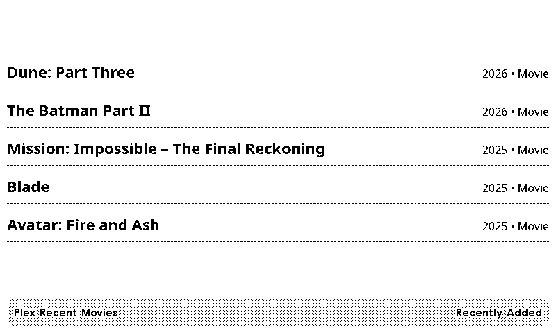
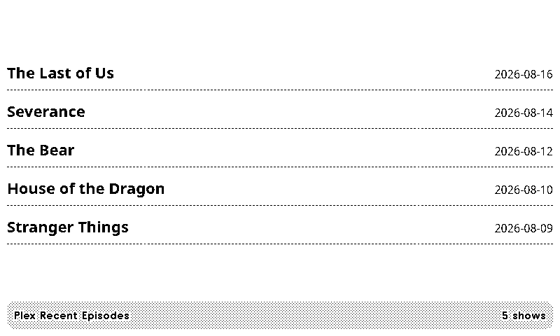
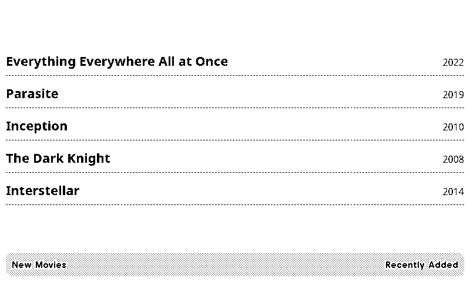
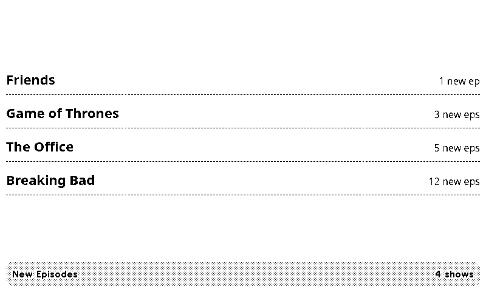
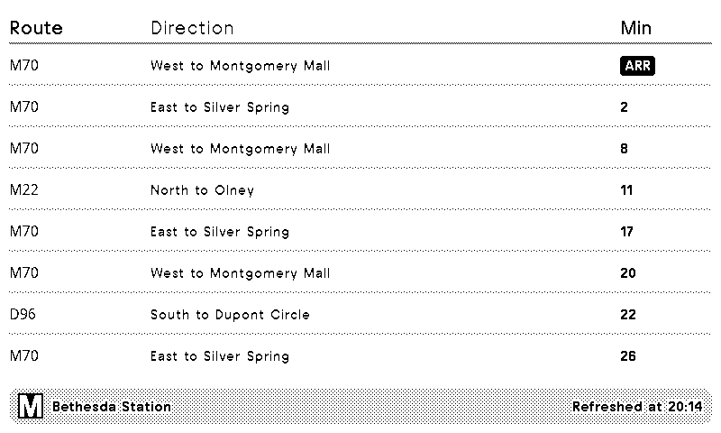

# Custom TRMNL / LaraPaper Recipes

A small collection of custom recipes built for a self-hosted [LaraPaper](https://github.com/usetrmnl/larapaper)
instance. Each folder is a standalone recipe in the standard `settings.yml` + `.liquid` format,
importable via LaraPaper's **Plugins → Import → Import Recipe Archive**, or usable as a base for
a submission to the [community recipe catalog](https://github.com/bnussbau/trmnl-recipe-catalog).

## Recipes

*(Screenshots use stubbed example titles/times, not real personal data.)*

### `plex-watchlist-movies`
Your Plex Watchlist movies, newest release first. Data source: Plex cloud
(`discover.provider.plex.tv`). Needs: personal Plex token.



### `plex-watchlist-episodes`
Your Plex Watchlist TV shows, sorted by most recent episode air date (not premiere date),
excludes anything more than N days out (configurable, default 3). Data source: Plex cloud.
Needs: personal Plex token.



### `plex-server-new-movies`
Recently added movies on your own Plex Media Server. Data source: your PMS. Needs: personal
Plex token + your server URL.



### `plex-server-new-episodes`
Recently added TV episodes on your own PMS, aggregated by show (not one row per episode).
Data source: your PMS. Needs: personal Plex token + your server URL.



### `wmata-bethesda-bus`
Combined bus arrival board for all three Metrobus routes serving Bethesda Station (D96, M22,
M70). Data source: WMATA NextBusService API. Needs: free WMATA developer API key.



## Setup

Each recipe's `settings.yml` lists its `custom_fields` — after importing, fill those in via the
plugin's edit screen in LaraPaper (or TRMNL). No field in any of these files contains a real
credential; they're all Liquid placeholders (`{{ field_name }}`) resolved from your own saved
configuration values at render time.

- **Plex token** — two ways to get one:
  1. **Via the Plex Web App** (needs access to some library content to click into — i.e. your
     own Plex Media Server, or one shared with you): sign in at
     [app.plex.tv](https://app.plex.tv) → click into any movie or show → the **⋮** menu →
     **Get Info** → **View XML** (link in the lower-left of that panel). A new tab opens with an
     XML page — the token is at the very end of the **browser's address bar URL**, not in the
     page content itself: `...&X-Plex-Token=yourtokenhere`.
  2. **Via a direct sign-in API call** (no Plex Media Server needed at all — works with just a
     Plex account/Watchlist, useful if you don't have your own server): run this yourself in a
     terminal, not through an AI assistant or anyone else, so your password is never shared with
     a third party — only the resulting token is:
     ```bash
     curl -s -X POST "https://plex.tv/users/sign_in.json" \
       -H "X-Plex-Client-Identifier: my-trmnl-setup" \
       -H "X-Plex-Product: TRMNL" \
       -d "user[login]=YOUR_PLEX_EMAIL" \
       -d "user[password]=YOUR_PLEX_PASSWORD" \
       | python3 -c "import json,sys; print(json.load(sys.stdin)['user']['authToken'])"
     ```
     This prints just the token. The `plex-watchlist-*` recipes only need this — they hit Plex's
     cloud API, not a personal server — so this method is enough even if you don't run a PMS.
     The `plex-server-*` recipes need an actual reachable server regardless of which method you
     used to get the token.

  Either way, treat the resulting token like a password — it grants full access to your Plex
  account/server.
- **Plex server section IDs**: visit `http://<your-server>:32400/library/sections` (with your
  token) to find the numeric ID for your Movies/TV Shows libraries — this varies per server
  depending on setup order, so it's not something that can be hardcoded.
- **WMATA API key**: free signup at [developer.wmata.com](https://developer.wmata.com/).
- **Title text** (all 4 Plex recipes): the title bar text is configurable via a `title_text`
  field, defaulting to the recipe's original title (e.g. "Plex Recent Movies"). Useful if you're
  running more than one instance of a recipe — e.g. one per household member's Plex — and want
  each screen labeled distinctly.

## Notes

- The `plex-watchlist-episodes` sort (by last-aired-episode date) happens client-side in the
  Liquid template, not via the Plex API's own `sort` parameter — Plex silently ignores
  `sort=lastEpisodeOriginallyAvailableAt` server-side, so this has to be handled in the recipe.
- The `wmata-bethesda-bus` recipe fetches three separate stop IDs (one per physical bus bay at
  Bethesda Station) via LaraPaper's multi-URL `polling_url` support (newline-separated URLs get
  merged into `data.IDX_0`, `data.IDX_1`, `data.IDX_2`), then combines and sorts them in Liquid.
  Adapting this to a different station means swapping the `StopID` values in `settings.yml`.

See [`CUSTOM_PLUGINS.md`](../CUSTOM_PLUGINS.md) in the parent directory for the full writeup,
including bugs found and fixed in *other* existing recipes along the way (not included in this
repo, since those are fixes to someone else's code, not new plugins — worth submitting as PRs
against their original repos instead).

## Authorship

These recipes were authored with [Claude Code](https://claude.com/claude-code), working through
LaraPaper's actual database and container to build, test, and debug each recipe against live
data before exporting it here.
